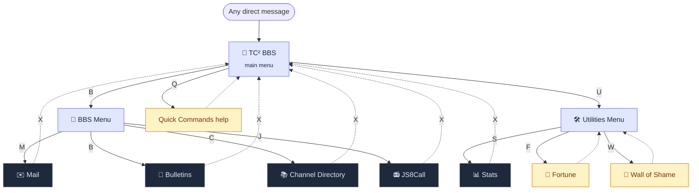

# TC²-BBS Meshtastic Version

[](https://ko-fi.com/B0B1OZ22Z)

This is the TC²-BBS system integrated with Meshtastic devices. The system allows for message handling, bulletin boards, mail systems, and a channel directory.

### Docker

If you're a Docker user, TC²-BBS Meshtastic is available on Docker Hub!

[](https://hub.docker.com/r/thealhu/tc2-bbs-mesh)

## Setup

### Requirements

- Python 3.x
- Meshtastic
- pypubsub

### Update and Install Git
   
   ```sh
   sudo apt update
   sudo apt upgrade
   sudo apt install git
   ```

### Installation

1. Clone the repository:
   
   ```sh
   cd ~
   git clone https://github.com/TheCommsChannel/TC2-BBS-mesh.git
   cd TC2-BBS-mesh
   ```

2. Set up a Python virtual environment:  
   
   ```sh
   python -m venv venv
   ```

3. Activate the virtual environment:  
   
   - On Windows:  
   
   ```sh
   venv\Scripts\activate  
   ```
   
   - On macOS and Linux:
   
   ```sh
   source venv/bin/activate
   ```

4. Install the required packages:  
   
   ```sh
   pip install -r requirements.txt
   ```

5. Rename `example_config.ini`:

   ```sh
   mv example_config.ini config.ini
   ```

6. Set up the configuration in `config.ini`:  

   You'll need to open up the config.ini file in a text editor and make your changes following the instructions below
   
   **[interface]**  
   If using `type = serial` and you have multiple devices connected, you will need to uncomment the `port =` line and enter the port of your device.   
   
   Linux Example:  
   `port = /dev/ttyUSB0`   
   
   Windows Example:  
   `port = COM3`   
   
   If using type = tcp you will need to uncomment the hostname = 192.168.x.x line and put in the IP address of your Meshtastic device.  
   
   **[sync]**  
   Enter a list of other BBS nodes you would like to sync messages and bulletins with. Separate each by comma and no spaces as shown in the example below.   
   You can find the nodeID in the menu under `Radio Configuration > User` for each node, or use this script for getting nodedb data from a device:  
   
   [Meshtastic-Python-Examples/print-nodedb.py at main · pdxlocations/Meshtastic-Python-Examples (github.com)](https://github.com/pdxlocations/Meshtastic-Python-Examples/blob/main/print-nodedb.py)  
   
   Example Config:  
   
   ```ini
   [interface]  
   type = serial  
   # port = /dev/ttyUSB0  
   # hostname = 192.168.x.x  
   
   [sync]  
   bbs_nodes = !f53f4abc,!f3abc123  
   ```

### Running the Server

Run the server with:

```sh
python server.py
```

Be sure you've followed the Python virtual environment steps above and activated it before running.

## Command line arguments
```
$ python server.py --help

████████╗ ██████╗██████╗       ██████╗ ██████╗ ███████╗
╚══██╔══╝██╔════╝╚════██╗      ██╔══██╗██╔══██╗██╔════╝
   ██║   ██║      █████╔╝█████╗██████╔╝██████╔╝███████╗
   ██║   ██║     ██╔═══╝ ╚════╝██╔══██╗██╔══██╗╚════██║
   ██║   ╚██████╗███████╗      ██████╔╝██████╔╝███████║
   ╚═╝    ╚═════╝╚══════╝      ╚═════╝ ╚═════╝ ╚══════╝
Meshtastic Version

usage: server.py [-h] [--config CONFIG] [--interface-type {serial,tcp}] [--port PORT] [--host HOST] [--mqtt-topic MQTT_TOPIC]

Meshtastic BBS system

options:
  -h, --help            show this help message and exit
  --config CONFIG, -c CONFIG
                        System configuration file
  --interface-type {serial,tcp}, -i {serial,tcp}
                        Node interface type
  --port PORT, -p PORT  Serial port
  --host HOST           TCP host address
  --mqtt-topic MQTT_TOPIC, -t MQTT_TOPIC
                        MQTT topic to subscribe
```


## Automatically run at boot

If you would like to have the script automatically run at boot, follow the steps below:

1. **Edit the service file**
   
   First, edit the mesh-bbs.service file using your preferred text editor. The 3 following lines in that file are what we need to edit:
   
   ```sh
   User=pi
   WorkingDirectory=/home/pi/TC2-BBS-mesh
   ExecStart=/home/pi/TC2-BBS-mesh/venv/bin/python3 /home/pi/TC2-BBS-mesh/server.py
   ```
   
   The file is currently setup for a user named 'pi' and assumes that the TC2-BBS-mesh directory is located in the home directory (which it should be if the earlier directions were followed)
   
   We just need to replace the 4 parts that have "pi" in those 3 lines with your username.

2. **Configuring systemd**
   
   From the TC2-BBS-mesh directory, run the following commands:
   
   ```sh
   sudo cp mesh-bbs.service /etc/systemd/system/
   ```
   
   ```sh
   sudo systemctl enable mesh-bbs.service
   ```
   
   ```sh
   sudo systemctl start mesh-bbs.service
   ```
   
   The service should be started now and should start anytime your device is powered on or rebooted. You can check the status of the service by running the following command:
   
   ```sh
   sudo systemctl status mesh-bbs.service
   ```
   
   If you need to stop the service, you can run the following:
   
   ```sh
   sudo systemctl stop mesh-bbs.service
   ```
   
   If you need to restart the service, you can do so with the following command:
   
   ```sh
   sudo systemctl restart mesh-bbs.service
   ```

2. **Viewing Logs**

   Viewing past logs:
   ```sh
   journalctl -u mesh-bbs.service
   ```

   Viewing live logs:
   ```sh
   journalctl -u mesh-bbs.service -f
   ```

## Radio Configuration

Note: There have been reports of issues with some device roles that may allow the BBS to communicate for a short time, but then the BBS will stop responding to requests. 

The following device roles have been working: 
- **Client**
- **Router_Client**

## Features

- **Mail System**: Send and receive mail messages.
- **Bulletin Boards**: Post and view bulletins on various boards.
- **Channel Directory**: Add and view channels in the directory.
- **Statistics**: View statistics about nodes, hardware, and roles.
- **Wall of Shame**: View devices with low battery levels.
- **Fortune Teller**: Get a random fortune. Pulls from the fortunes.txt file. Feel free to edit this file remove or add more if you like.

## Usage

You interact with the BBS by sending direct messages to the node that's connected to the system running the Python script. Sending any message to it will get a response with the main menu.  
Make selections by sending messages based on the letter or number in brackets - Send M for [M]ail Menu for example.

A video of it in use is available on our YouTube channel:

[](https://www.youtube.com/watch?v=d6LhY4HoimU)

## Conversation map

Every conversation starts at the main menu. Selecting a letter either **enters a
flow** (a multi-step conversation like Mail or Bulletins) or triggers a **leaf**
(a one-shot reply that leaves you where you are). Sending `X` from anywhere
returns you to the main menu.



Solid arrows move you somewhere; dashed arrows return you. Dark boxes are flows,
amber boxes are leaves, and light boxes are menus.

Which letters each menu offers is configurable — see `[menu]` in `config.ini`.
Removing a letter there removes it from the menu.

### Quick commands

Quick commands skip the menus entirely. They can be sent at any time, and they
leave the conversation exactly where it was — sending `CM` halfway through
composing a bulletin answers your mailbox and leaves you still composing.

| Command | Does |
| --- | --- |
| `SM,,{short_name},,{subject},,{message}` | Send mail |
| `CM` | Check mail |
| `PB,,{board},,{subject},,{content}` | Post a bulletin |
| `CB,,{board}` | Check bulletins on a board |
| `CHP,,{name},,{url}` | Post a channel to the directory |
| `CHL` | List channels |

`{board}` must be one of General, Info, News, or Urgent. Posting to Urgent
broadcasts a notice to the whole mesh, so it is restricted to the nodes listed
under `[allow_list]` in `config.ini` — whether you post through the menu or
through `PB,,`. If that section is absent, anyone may post there.

### For contributors

Each conversation topic is a **Flow** — a pure module that, given a message and
the current state, returns what to reply and where the conversation goes next.
A **Session** dispatches to the flow that owns the current topic. The domain
vocabulary lives in [CONTEXT.md](CONTEXT.md), and the reasoning behind this
shape is recorded in [docs/adr/](docs/adr/).

## Thanks

**Meshtastic:**

Big thanks to [Meshtastic](https://github.com/meshtastic) and [pdxlocations](https://github.com/pdxlocations) for the great Python examples:

[python/examples at master · meshtastic/python (github.com)](https://github.com/meshtastic/python/tree/master/examples)

[pdxlocations/Meshtastic-Python-Examples (github.com)](https://github.com/pdxlocations/Meshtastic-Python-Examples)

**JS8Call:**

For the JS8Call side of things, big thanks to Jordan Sherer for JS8Call and the [example API Python script](https://bitbucket.org/widefido/js8call/src/js8call/tcp.py)

## License

GNU General Public License v3.0
